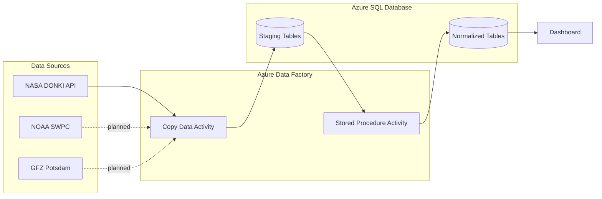
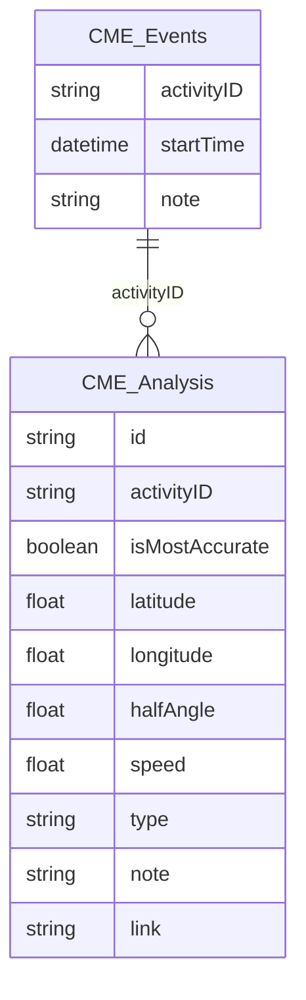

# Space Weather Dashboard
 
An automated data pipeline and dashboard for tracking space weather events — coronal mass ejections (CMEs), geomagnetic storms, and their real-world impacts — pulled daily from public space weather APIs.
 
## Overview
 
Space weather agencies (NASA, NOAA, GFZ Potsdam) each publish valuable data through their own APIs, but there's no single place to see it all together or explore how events like CMEs connect to real-world impacts. This project builds:
 
1. **A daily ETL pipeline** that ingests, normalizes, and stores space weather data from multiple sources into a single relational database
2. **A dashboard** that visualizes this data, starting with the geographic/real-world impact of CME events

## Planned Architecture
 

 
Each API is ingested via Azure Data Factory activities, landed in a staging table, then transformed and de-duplicated into normalized tables via a T-SQL stored procedure orchestrated by ADF. The dashboard will read from the normalized tables.

# Database Schema
 
Current normalized schema for CME data:
 

 
`CME_Events` holds one row per CME event. Since NASA's DONKI API returns multiple analysis estimates per event (from different modeling approaches/analysts), `CME_Analysis` holds a one-to-many relationship back to its parent event via `activityID`, with `isMostAccurate` flagging the preferred estimate.
 
This schema will grow as NOAA SWPC and GFZ Potsdam data are added — likely with additional event tables (e.g. geomagnetic storms) linked back to `CME_Events` where relationships exist.

# Tech Stack
 
- **Orchestration / ETL:** Azure Data Factory
- **Database:** Azure SQL
- **Transformations:** T-SQL (stored procedures)
- **Dashboard:** TBD

## Data Sources
 
- [NASA DONKI](https://ccmc.gsfc.nasa.gov/tools/DONKI/) — Space Weather Database of Notifications, Knowledge, Information
- [NOAA SWPC](https://www.spaceweather.gov/products-and-data) — Space Weather Prediction Center products and data
- [GFZ Potsdam Kp Index](https://kp.gfz-potsdam.de/en/) — Geomagnetic Kp index data

---
 
*This project is a work in progress — check back for updates as new pipelines and the dashboard come online.*
